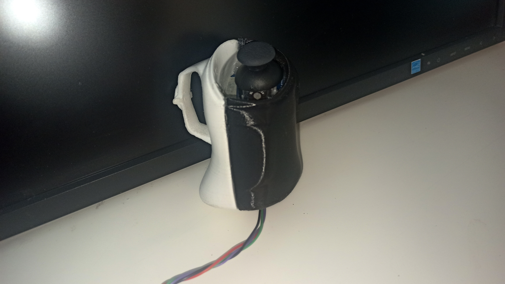

# Process of OF NO BOUNDS

#### (1)  Research

Research games, the ways of music interaction, visual design, and style

#### (2)  Brain storming

Designed story Line, UX, discuss about the game theme.

#### (3)  Research and try different interaction hardware and build Interactive framework

Try different clips and hardwares, like Leapmition, kinect, piazo, midi board, slider and so on

#### (4)  Build the 3D model and landscape (Blender, UE5)

We tried to use blender to build the landscape by Grayscale in Blender, but it looks better just build from 0 by capturing it in Unreal

#### (5)  Put models into the world (UE5)

#### (6)  Design the UI (Blender)

We didn't got time to put all of them into the game yet, but we will make it later on

#### (7)  Make music and record city sound samples(Logic, midi board and voice memos)

#### (8)   Draw materials for city models(Substance Painter)

We run into errors after designing 3D-to-2D styles in Blender, we can't import them into Unreal, so we used the SP to paint the materials.

Blender

Substance Painter

Moodboard

#### (9)   Link the materials to 3D models(UE5)

@GW补图

#### (10) Make visual and music interaction function (UE5)

#### (11) Link virtual world interaction with Kinect(Azure Kinect Body Tracking SDK 1.1.2)

@GW

#### (12) Design and 3D print controller (Blender, Ultimaker-Cura)

We hand-made the controllers first, then designed it in Blender and printed it out. Tested, designed again, then print out the third one.

#### (13) Sewing clips and put into the controller(Arduino, hand making material)

#### (14) Iteration Design

For UX, UI, Controller version1 to 3

#### (15)Preapring materials for exhibition

#### (16)Test, interview and make iteration design

Audiences suggested that add some guidelines to know where to go, in case they get lost. Some of them wish to make the Kinect control easier, and some of them think the game is a bit too long for a game exhibition. So we developed a map, and guidelines and will make more iterated designs based on the feedback.

#### (17)Meeting for further developing

We are still have meetings and making developing plans, we wish to make the UX and UI feels and looks better, it could also be treated as a begging of building metaverse music shows, we will bring up more developing visions&#x20;
