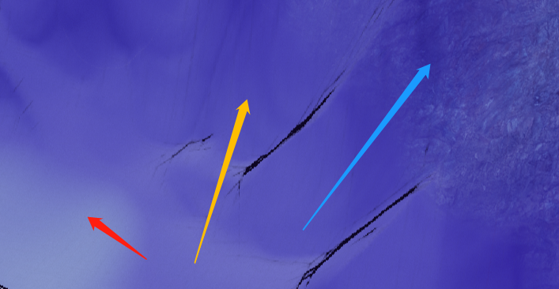

# OF NO BOUND

Guanghan Wu | Yuwei Chen

Unreal Engine 5 | Arduino | Azure kinect | 3D printed controller | Blender | Logic | Substance Painter

### Links

#### Video Link(Youtube):

[https://youtu.be/e\_DOIYrOQ9U](https://youtu.be/e_DOIYrOQ9U "https://youtu.be/e_DOIYrOQ9U")

#### INFO:

(1) Our UE5 File name is originally called TGPtestingUE5, not the "Of No Bounds", and to change the name of the UE project could be troublesome, so you will see the Folder and file named TGPtestingUE5

(2) Must start from "PermanentLevel", which is a intermedia level

(3) We use the Virtual Texture so if you want to open the project, please turn on the Virtual texture support in project settings.

#### Google Drive Link:

[https://drive.google.com/drive/folders/13GZ9lWX3qZiov7g2qAy7t5r3scRGhCLE?usp=sharing](https://drive.google.com/drive/folders/13GZ9lWX3qZiov7g2qAy7t5r3scRGhCLE?usp=sharing "https://drive.google.com/drive/folders/13GZ9lWX3qZiov7g2qAy7t5r3scRGhCLE?usp=sharing")

#### Open Words

We made a virtual game whose world was abandoned for unknown reasons, with the cel-shading style. The Player will use a new joystick to control a virtual character with his left hand, and the Kinect interaction will need his right hand.

## CATALOGUE

### I. Background and Stories

### II. Devices And Applications

### III. Production Process

### IV. Details of Blueprints in UE5

### V. Other miscellaneous(Usage INFOs)

### Background and Stories

This project, simulating the research team in 2122, looked back on the virtual world revolution about 50 years ago, and made a rehabilitation design for the degeneration of human limbs after that, to arouse people's awareness of the current, real world.

In contrast, the design team tries to provoke people's reflection about how the virtual world limits real-world activity by limiting the range of activities of the experiencer, and by attracting the player's attention while ignoring parts of the real-world experience. The game limits the physical user experience to 1 square meter space. The Kinect and thumb manipulators allow participants to control the game only through upper body activities and explore in the open virtual world.

The project ‘Of No Bound’ aims to express that there are many endless things, but the present moment is precious. In the era of excess information, 'Tittytainment' has occupied too much attention from people. On the way to pursuing a bigger goal, people also need to stop occasionally, pay attention to the second to experience the now, and also pay attention to the connection between the individual and the world. In the wave of fake news & propaganda, find the reef of independent thinking. ‘The grass is always greener on the other side, every moment that we are aware and experience makes us who we are.

### Devices And Applications

Hardware： Laptop, Azure Kinect, 3D printed controller(designed by ourselves) connected by Arduino

Software:     Unreal Engine 5, Kinect, Arduino, Blender, Substance Painter, Logic

### Production process

#### (1)  Research

Research games, the ways of music interaction, visual design, and style

#### (2)  Brain storming

Designed story Line, UX, discuss about the game theme.

#### (3)  Research and try different interaction hardware and build Interactive framework

Try different clips and hardwares, like Leapmition, kinect, piazo, midi board, slider and so on

#### (4)  Build the 3D model and landscape (Blender, UE5)

We tried to use blender to build the landscape by Grayscale in Blender, but it looks better just capture it in Unreal

#### (5)  Put models into the world (UE5)

#### (6)  Design the UI (Blender)

We didn't got time to put all of them into the game yet, but we will make it later on

#### (7)  Make music and record city sound samples(Logic, midi board and voice memos)

#### (8)  Draw materials for city models(Substance Painter)

We run into errors after designing 3D-to-2D styles in Blender, we can't import them into Unreal, so we used the SP to paint the materials.

#### (9)  Link the materials to 3D models(UE5)

#### (10) Make visual and music interaction function (UE5)

#### (11) Link virtual world interaction with Kinect(Azure Kinect Body Tracking SDK 1.1.2)

#### (12) Design and 3D print controller (Blender, Ultimaker-Cura)

We hand-made the controller first, then designed it in Blender and printed it out. Tested, designed again, then print out the third one.

#### (13) Sewing clips and put into the controller(Arduino, hand making material)

#### (14) Iteration Design

For UX, UI, Controller version1 to 3

#### (15)Preapring materials for exhibition

#### (16)Test, interview and make iteration design

#### (17)Meeting for further developing

### Details of Blueprints in UE5

#### (1)Landscape

We use four layers of landscape

#### (2)Materials

First are the 3 Landscape materials:

Flashing Ball:

#### (3)Niagara System (Effects）

All the effects in our game are fitted with Audios, by using Audio Spectrum and fed it with the particles' Normalized age, which is from 0-1, and put in spectrum then the particle can get some delta value.

#### (4)Shading(Rendering Pipeline)

We use the PostProcess Volume way to adjust the style of our game, and the pipeline script is here:

Overall:

2\*2 convolution kernel for edge detection:

Blend the four parts and ge rid of the Sky(Without this the sky blacklines will turn up):

#### (5)Kinect(OpenResource Plug-in "AzureKinectUnreal")

\*\*Plug-in link: \*\*

[secretlocation/azure-kinect-unreal: Azure Kinect Body Tracking plugin for Unreal (github.com)](https://github.com/secretlocation/azure-kinect-unreal "secretlocation/azure-kinect-unreal: Azure Kinect Body Tracking plugin for Unreal (github.com)")

**!!!Actually, it is no way to use it if directly put in the UE5, but I indeed add a lot of SDK(Azure Kinect Body Tracking SDK 1.1.2) files in my windows environment so that it can work well**.

I use 3 points' positions of the right hand(and get their average value), then transfer them into the Interactive blue ball's **velocity**.

Kinect BluePrints are here:

In Interaction Point BP:

#### (6)Arduino(OpenResource Plug-in "SERIALCOM")

\*\*Plug-in link: \*\*

[videofeedback/Unreal\_Engine\_SerialCOM\_Plugin: Serial Com Port Library for Unreal Engine 4 and Unreal Engine 5 (github.com)](https://github.com/videofeedback/Unreal_Engine_SerialCOM_Plugin "videofeedback/Unreal_Engine_SerialCOM_Plugin: Serial Com Port Library for Unreal Engine 4 and Unreal Engine 5 (github.com)")

The Arduino in our Program is used to receive our 3d printed controller's data(x and y), as the plug-in "SERIALCOM" in UE5 could not receive multi-value, I made them as a line-string, after mapping from 0-700  to 100-200 (e.g. one string would be "146146")

Here is the BluePrint connect the arduino

Then make the data control the player's eyesight and movement control

### Other miscellaneous(Usage INFOs)

#### Our Labor Division:

Wu: Technical(UE5 for Game Play Edit, Kinect for motion capture, 3D modeling, stylized the environment，UE5 Parameter Adjustment for more beautiful and Blender for Towers in-game), Contribution = 50%

Chen: Artist(UE5 for Game Play Edit, Kinect for motion capture, Arduino Code and Blender for JoyHandle，Niagara System, Audio & visual, Substance-Painter for texture painting, UE5 Parameter Adjustment for more beautiful and Blender for Towers in-game), Contribution = 50%
